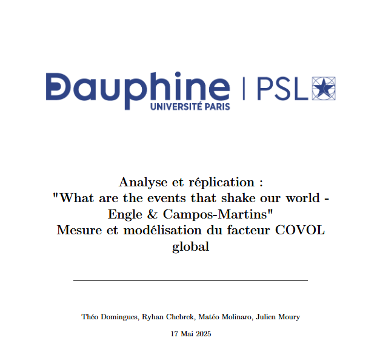
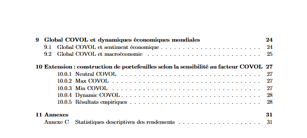

# COVOL
This repo contains the code and some reproduction results of "What are the events that shake our world? Measuring and hedging global COVOL, Robert F. Engle ,  Susana Campos-Martins (2023)".

  
  
  

  
  
  
  

